# 📊 Temporal in Action: Order Processing Workflow

This diagram shows how Temporal handles a real-world order processing workflow with automatic retries, state persistence, and resilient execution.

```mermaid
sequenceDiagram
    participant U as Customer
    participant W as Order Workflow
    participant I as Inventory Service
    participant P as Payment Service
    participant S as Shipping Service
    participant N as Notification Service
    
    Note over U,N: Temporal Workflow Orchestration
    
    U->>W: Place Order
    W->>W: 📝 Persist: Order Created
    
    Note over W,N: Step 1: Inventory Check (with retries)
    W->>I: Check Inventory
    I-->>W: ❌ Service Timeout
    Note over W: Auto-retry with backoff (1s)
    W->>I: Check Inventory (Retry 1)
    I-->>W: ❌ Service Unavailable  
    Note over W: Auto-retry with backoff (2s)
    W->>I: Check Inventory (Retry 2)
    I->>W: ✅ Inventory Available
    W->>W: 📝 Persist: Inventory Reserved
    
    Note over W,N: Step 2: Payment Processing
    W->>P: Process Payment
    P->>W: ✅ Payment Successful
    W->>W: 📝 Persist: Payment Completed
    
    Note over W,N: Step 3: Shipping Coordination
    W->>S: Schedule Shipping
    S->>W: ✅ Shipping Scheduled
    W->>W: 📝 Persist: Shipping Arranged
    
    Note over W,N: Step 4: Customer Notification
    W->>N: Send Confirmation Email
    N->>W: ✅ Email Sent
    W->>N: Send SMS Update
    N-->>W: ❌ SMS Service Down
    Note over W: Continue workflow (non-critical failure)
    W->>W: 📝 Persist: Order Completed
    
    W->>U: ✅ Order Confirmation
    
    rect rgb(255, 245, 245)
        Note over U,N: 🛡️ Temporal Guarantees:<br/>• Automatic retries with exponential backoff<br/>• State persisted at each step<br/>• Workflow survives server crashes<br/>• Exactly-once execution<br/>• Comprehensive observability
    end
    
    rect rgb(245, 255, 245)
        Note over U,N: 🔄 Without Temporal:<br/>• Manual retry logic everywhere<br/>• Complex state management<br/>• Brittle failure handling<br/>• Difficult testing and debugging<br/>• Lost transactions on crashes
    end
```

> 💡 **Key Insight**: This workflow looks simple but handles complex distributed systems challenges automatically. Temporal manages retries, state persistence, and failure recovery while your code stays clean and readable.

## 🎯 What This Diagram Shows

### 🛡️ **Temporal's Magic**:
- **Automatic Retries**: Inventory service fails twice but Temporal retries with smart backoff
- **State Persistence**: Each step saves progress (📝) so crashes can't lose work  
- **Resilient Execution**: SMS failure doesn't break the entire workflow
- **Clean Code**: The workflow logic stays simple despite complex retry/failure scenarios

### 🔥 **Real-World Impact**:
- **No Lost Orders**: Server crashes can't cause partially processed orders
- **Better Customer Experience**: Reliable order processing with automatic recovery
- **Easier Development**: Focus on business logic instead of infrastructure concerns
- **Operational Confidence**: Built-in observability and debugging capabilities

### 🚀 **This is Just the Beginning**:
As you progress through the bootcamp, you'll learn to build workflows that:
- Handle much more complex business logic
- Coordinate dozens of services
- Wait for human approvals
- Process data in parallel
- Scale to millions of executions

Ready to build this yourself? Let's start with Lesson 1! 🎉