# 📊 Temporal in Action

## Order Processing Workflow Demo

This diagram shows how Temporal handles a **real-world order processing workflow** with:

- ✅ Automatic retries
- ✅ State persistence  
- ✅ Resilient execution

**Let's see Temporal's magic in action!**

---

# 🔄 The Order Processing Flow

```mermaid
sequenceDiagram
    participant U as Customer
    participant W as Order Workflow
    participant I as Inventory Service
    participant P as Payment Service
    participant S as Shipping Service
    participant N as Notification Service
    
    Note over U,N: Temporal Workflow Orchestration
    
    U->>W: Place Order
    W->>W: 📝 Persist: Order Created
```

**Step 1**: Customer places order, Temporal immediately persists the state

---

# 🏪 Inventory Check (with Retries)

**Notice**: Temporal automatically retries failed calls with smart backoff!

---

# 💳 Payment Processing

```mermaid
sequenceDiagram
    participant W as Order Workflow
    participant P as Payment Service
    
    Note over W,P: Step 2: Payment Processing
    W->>P: Process Payment
    P->>W: ✅ Payment Successful
    W->>W: 📝 Persist: Payment Completed
```

**Key Point**: Each successful step is persisted before moving to the next

---

# 📦 Shipping & Notifications

```mermaid
sequenceDiagram
    participant W as Order Workflow
    participant S as Shipping Service
    participant N as Notification Service
    
    Note over W,N: Step 3: Shipping Coordination
    W->>S: Schedule Shipping
    S->>W: ✅ Shipping Scheduled
    W->>W: 📝 Persist: Shipping Arranged
    
    Note over W,N: Step 4: Customer Notification
    W->>N: Send Confirmation Email
    N->>W: ✅ Email Sent
    W->>N: Send SMS Update
    N-->>W: ❌ SMS Service Down
    Note over W: Continue workflow (non-critical failure)
    W->>W: 📝 Persist: Order Completed
```

**Smart Handling**: SMS failure doesn't break the entire workflow!

---

# 🛡️ Temporal's Guarantees

## **What Temporal Provides Automatically:**

- ✅ **Automatic retries** with exponential backoff
- ✅ **State persisted** at each step
- ✅ **Workflow survives** server crashes
- ✅ **Exactly-once execution** 
- ✅ **Comprehensive observability**

**Result**: Bulletproof distributed systems with simple code!

---

# 🔄 Without Temporal (The Hard Way)

## **What you'd have to build manually:**

- ❌ Manual retry logic everywhere
- ❌ Complex state management
- ❌ Brittle failure handling
- ❌ Difficult testing and debugging
- ❌ Lost transactions on crashes

**Result**: Months of infrastructure work, bugs, and maintenance nightmares

---

# 🎯 What This Diagram Shows

## **Temporal's Magic:**
- **Automatic Retries**: Inventory service fails twice but Temporal retries with smart backoff
- **State Persistence**: Each step saves progress (📝) so crashes can't lose work  
- **Resilient Execution**: SMS failure doesn't break the entire workflow
- **Clean Code**: Workflow logic stays simple despite complex retry/failure scenarios

---

# 🔥 Real-World Impact

## **Business Benefits:**
- **No Lost Orders**: Server crashes can't cause partially processed orders
- **Better Customer Experience**: Reliable order processing with automatic recovery
- **Easier Development**: Focus on business logic instead of infrastructure concerns
- **Operational Confidence**: Built-in observability and debugging capabilities

---

# 🚀 This is Just the Beginning

## **As you progress through the bootcamp, you'll learn to build workflows that:**

- Handle much more complex business logic
- Coordinate dozens of services
- Wait for human approvals  
- Process data in parallel
- Scale to millions of executions

---

# 💡 Key Insight

> **This workflow looks simple but handles complex distributed systems challenges automatically.**

**Temporal manages retries, state persistence, and failure recovery while your code stays clean and readable.**

---

# 🎉 Ready to Build This Yourself?

**You've seen the power of Temporal in action!**

## Next Steps:
1. Start with **Lesson 1: Hello Temporal**
2. Learn the fundamentals step by step
3. Build increasingly complex workflows
4. Master production-ready patterns

**Let's start building! 🚀** 