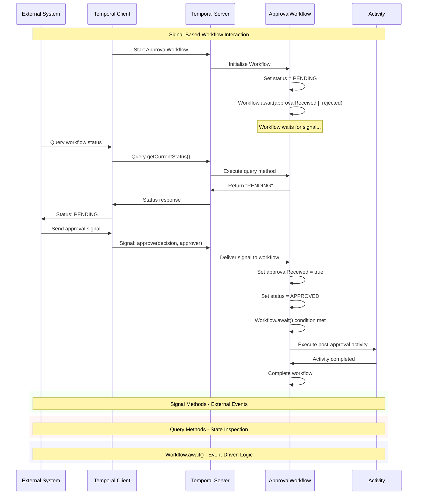

# 📜 Diagram for Lesson 10: Signals

This diagram visualizes signal handling patterns and how external systems can interact with long-running workflows through signals and queries.

> 💡 This sequence diagram shows how signals enable external systems to interact with long-running workflows. Signals are asynchronous events that can change workflow state, while queries provide real-time inspection of workflow status without affecting execution. 