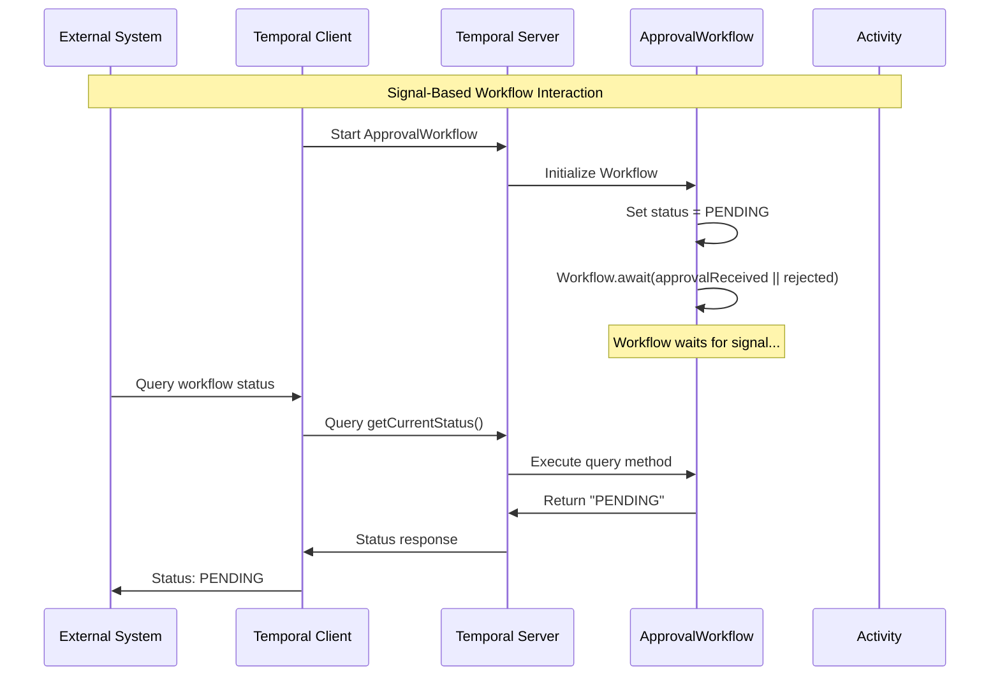
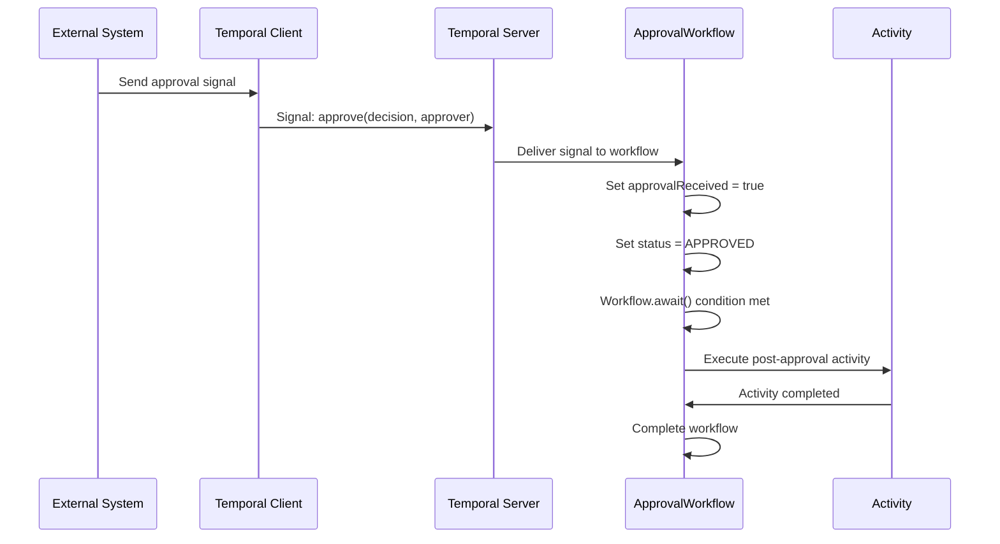

# 📜 Diagram for Lesson 10: Signals

## Visualizing Interactive Workflow Patterns

*Signal handling patterns and how external systems can interact with long-running workflows through signals and queries*

---

# Signal-Based Workflow Interaction



---

# Signal Delivery and Processing



---

# Interaction Pattern Categories

```mermaid
graph TB
    subgraph "Signal Methods - External Events"
        A[Signal Delivery]
        B[State Modification]
        C[Workflow Continuation]
        A --> B --> C
    end
    
    subgraph "Query Methods - State Inspection"
        D[Query Request]
        E[Current State Read]
        F[Immediate Response]
        D --> E --> F
    end
    
    subgraph "Workflow.await() - Event-Driven Logic"
        G[Condition Check]
        H[Block Until Met]
        I[Continue Execution]
        G --> H --> I
    end
    
    style A fill:#e8f5e8
    style D fill:#ffebee
    style G fill:#e3f2fd
```



---

# 💡 Key Insights from Signal Flow

## **Signal Characteristics:**

- ✅ **Asynchronous delivery** - External systems don't wait
- ✅ **Persistent in history** - Signals are replayed during workflow recovery
- ✅ **State modification** - Can trigger workflow logic changes
- ✅ **Event-driven patterns** - Enable reactive workflow behavior

## **Query Characteristics:**

- ✅ **Synchronous response** - Immediate state visibility
- ✅ **No side effects** - Read-only operations
- ✅ **Not persisted** - Don't affect workflow history
- ✅ **Real-time monitoring** - Current state inspection

---

# Workflow.await() Pattern

## **Event-Driven Blocking:**

```mermaid
flowchart TD
    A[Workflow.await() Called] --> B{Condition Met?}
    B --Yes--> C[Continue Execution]
    B --No--> D[Block and Wait]
    D --> E[Signal Received]
    E --> F[Update State]
    F --> B
    
    style A fill:#e3f2fd
    style C fill:#e8f5e8
    style D fill:#fff3e0
    style E fill:#f3e5f5
```

**Enables workflows to wait for external events without consuming resources**

---

# 🚀 Production Benefits

**This signal pattern provides:**

- ✅ **Interactive workflows** that respond to human decisions
- ✅ **Real-time observability** through query methods
- ✅ **Event-driven architecture** for reactive systems
- ✅ **Long-running processes** that wait for external events
- ✅ **Efficient resource usage** through conditional blocking

**Building responsive, interactive distributed systems! 🎉** 