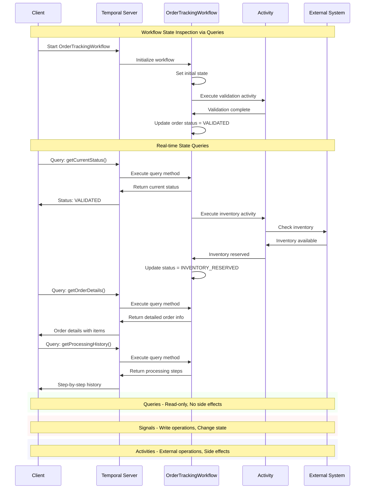

# 📜 Diagram for Lesson 11: Queries

This diagram visualizes query patterns for inspecting workflow state and how queries differ from signals and activities.

> 💡 This sequence diagram demonstrates how queries provide real-time, read-only access to workflow state without affecting execution. Unlike signals (which change state) or activities (which have side effects), queries are purely for inspection and monitoring. 