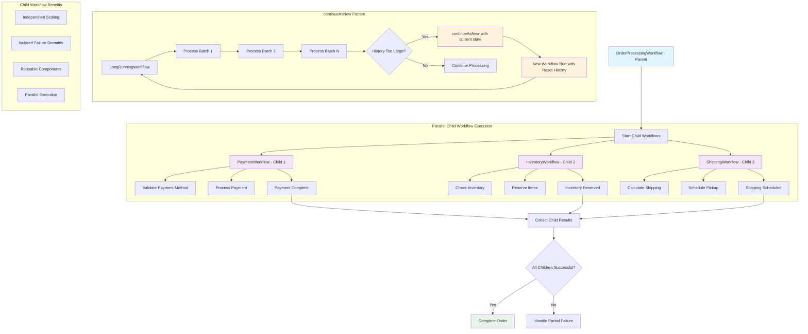

# 📜 Diagram for Lesson 12: Child Workflows & continueAsNew

This diagram visualizes the hierarchical workflow orchestration with child workflows and the continueAsNew pattern for managing workflow history.

> 💡 This diagram shows how parent workflows can orchestrate multiple child workflows in parallel, each handling a specific domain of business logic. The continueAsNew pattern prevents workflow history from growing too large by starting a new workflow run while preserving state. 