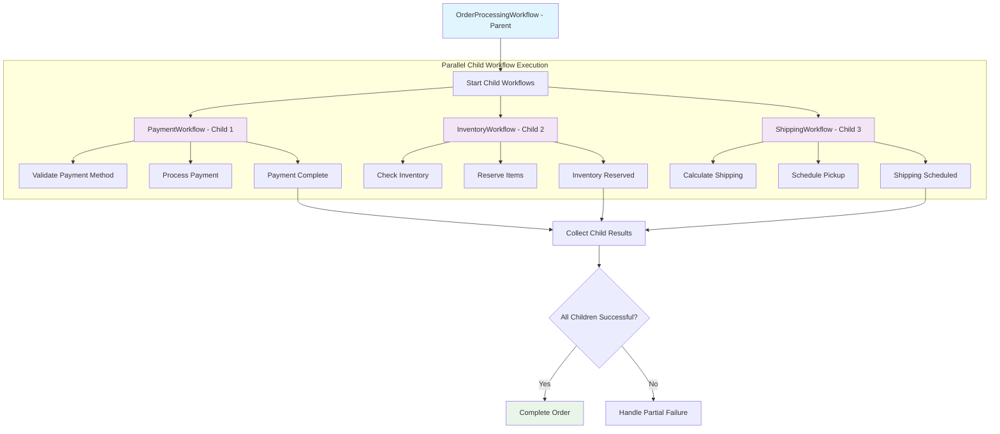
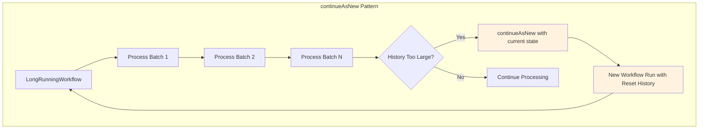
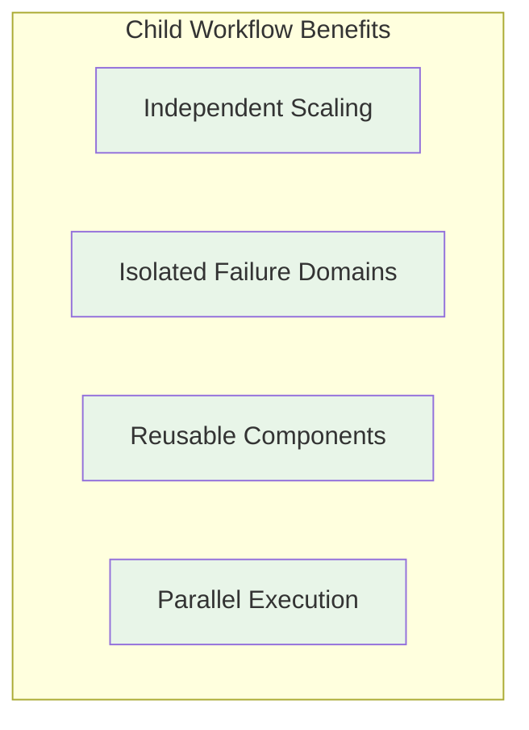

# 📜 Diagram for Lesson 12

## Child Workflows & continueAsNew

*Visualizing hierarchical workflow orchestration with child workflows and the continueAsNew pattern for managing workflow history*

---

# Hierarchical Workflow Orchestration

---

# continueAsNew Pattern

**continueAsNew prevents workflow history from growing too large by starting a new workflow run while preserving state**

---

# Child Workflow Benefits

## **Key Advantages:**
- ✅ **Independent Scaling**: Each child can scale based on its workload
- ✅ **Isolated Failure Domains**: Child failures don't crash parent
- ✅ **Reusable Components**: Child workflows can be reused across parents
- ✅ **Parallel Execution**: Multiple children execute simultaneously

---

# Orchestration Patterns

## **Parent-Child Coordination:**

| Pattern | Use Case | Benefits |
|---------|----------|----------|
| **Sequential** | Dependent operations | Clear ordering, simple error handling |
| **Parallel** | Independent operations | Faster execution, better resource usage |
| **Dynamic** | Variable complexity | Flexible, adaptive to requirements |

## **History Management:**
- **continueAsNew** for long-running processes
- **State preservation** across workflow runs
- **Memory optimization** through history reset

---

# 💡 Key Orchestration Insights

## **What This Diagram Shows:**

- ✅ **Parent workflows** orchestrate multiple child workflows in parallel
- ✅ **Each child** handles a specific domain of business logic
- ✅ **continueAsNew pattern** prevents workflow history from growing too large
- ✅ **Hierarchical decomposition** enables complex business process management
- ✅ **Independent scaling** and failure isolation improve system resilience

---

# 🚀 Production Benefits

**This orchestration pattern provides:**

- ✅ **Scalable architecture** through child workflow composition
- ✅ **Fault tolerance** with isolated failure domains
- ✅ **Resource optimization** through independent scaling
- ✅ **Maintainable complexity** with clear separation of concerns
- ✅ **Long-running reliability** through continueAsNew

**Building robust, scalable distributed systems! 🎉** 