# 📜 Diagram for Lesson 14: Timers and Cron Workflows

This diagram visualizes timer-based workflow patterns including simple delays, conditional waits, and recurring cron workflows.

```mermaid
flowchart TD
    subgraph "Timer Workflow Patterns"
        A[TimerWorkflow Start] --> B{Timer Type?}
        
        B -- Simple Delay --> C[Workflow.sleep Duration]
        C --> D[Continue after delay]
        
        B -- Timeout Pattern --> E[Start parallel operations]
        E --> F[Operation 1]
        E --> G[Workflow.sleep timeout]
        F --> H{First to complete?}
        G --> H
        H -- Operation --> I[Use operation result]
        H -- Timeout --> J[Handle timeout case]
        
        B -- Conditional Wait --> K[Workflow.await condition + timeout]
        K --> L{Condition met?}
        L -- Yes --> M[Process condition]
        L -- Timeout --> N[Handle timeout]
        
        B -- Multiple Timers --> O[Schedule multiple sleeps]
        O --> P[Timer 1: 30 seconds]
        O --> Q[Timer 2: 60 seconds] 
        O --> R[Timer 3: 120 seconds]
        P --> S[Collect timer results]
        Q --> S
        R --> S
    end
    
    subgraph "Cron Workflow Pattern"
        T[CronWorkflow Start] --> U[Process current batch]
        U --> V[Wait until next schedule]
        V --> W[Workflow.sleep until next run]
        W --> X{Continue running?}
        X -- Yes --> Y[continueAsNew with state]
        X -- No --> Z[Complete workflow]
        Y --> T
        
        subgraph "Cron Features"
            AA[Configurable Schedule]
            BB[State Preservation] 
            CC[History Management]
            DD[Graceful Shutdown]
        end
    end
    
    subgraph "Timer Benefits"
        EE[Durable Delays - Survive Restarts]
        FF[Precise Scheduling - Timezone Aware]
        GG[Cancellable - Can be interrupted]
        HH[Efficient - No polling required]
    end
    
    style A fill:#e1f5fe
    style T fill:#e1f5fe
    style D fill:#e8f5e8
    style I fill:#e8f5e8
    style M fill:#e8f5e8
    style S fill:#e8f5e8
    style Y fill:#fff3e0
    style Z fill:#e8f5e8
    style J fill:#ffebee
    style N fill:#ffebee
```

> 💡 This diagram shows various timer patterns in Temporal workflows: simple delays for waiting, timeout patterns for time-bounded operations, conditional waits for event-driven logic, and cron workflows that use continueAsNew for recurring execution while managing workflow history. 