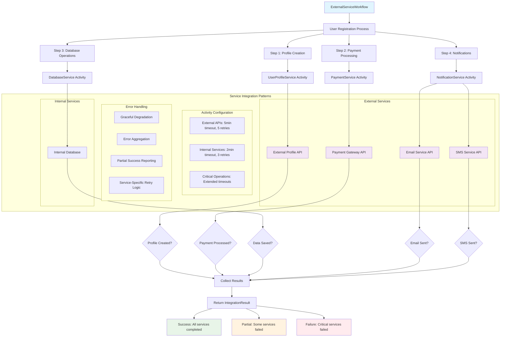

# 📜 Diagram for Lesson 15: External Service Integration

This diagram visualizes the architecture for integrating Temporal workflows with multiple external services using proper encapsulation and error handling patterns.

> 💡 This diagram demonstrates how to integrate workflows with multiple external services using activity encapsulation, different timeout strategies for different service types, and comprehensive error handling that allows for partial success scenarios. 