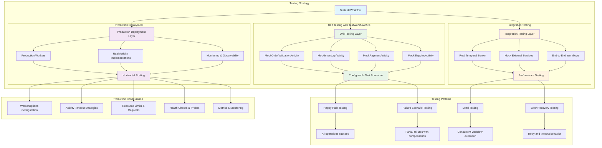

# 📜 Diagram for Lesson 16: Testing + Production Readiness

This diagram visualizes the comprehensive testing architecture and production deployment patterns for Temporal workflows.

> 💡 This diagram shows the comprehensive testing strategy from unit tests with mocks through integration testing to production deployment. Each layer has specific patterns and configurations optimized for its purpose, ensuring reliable workflow execution at scale. 