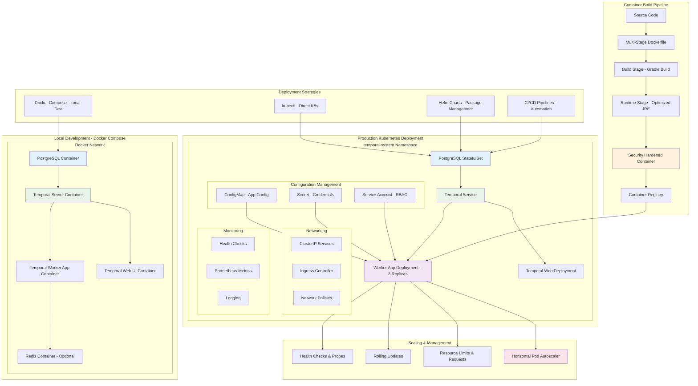

# 📜 Diagram for Lesson 17: Deployment & Production Infrastructure

This diagram visualizes the complete deployment architecture from local development to production Kubernetes deployment.

> 💡 This architecture diagram shows the complete deployment journey from containerized local development with Docker Compose to production-ready Kubernetes deployment with proper scaling, monitoring, and security configurations. 