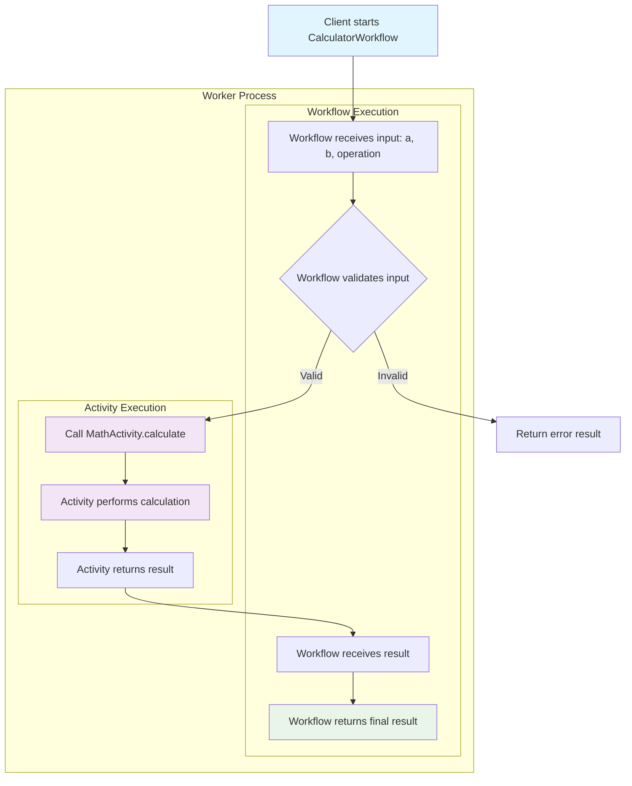
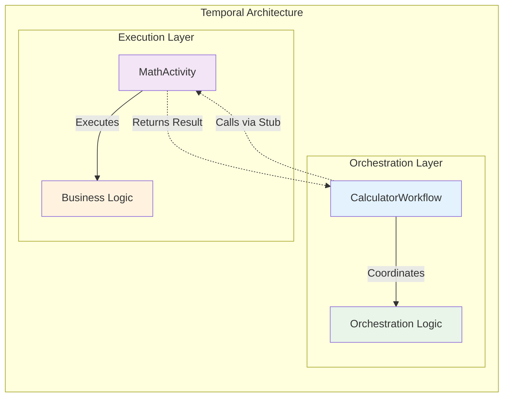

# 📜 Diagram for Lesson 5: Adding a Simple Activity

## Visualizing Workflow-Activity Communication

*Core architecture and communication flow between a workflow and its activities*

---

# Calculator Workflow Flow

---

# Architecture Separation

---

# 💡 Key Architecture Insights

## **Fundamental Pattern:**

- ✅ **Workflows orchestrate** - decision making and flow control
- ✅ **Activities execute** - actual business logic and external calls
- ✅ **Clear separation** between coordination and execution
- ✅ **Deterministic workflows** call non-deterministic activities
- ✅ **Activity stubs** provide type-safe communication

## **Benefits:**
- **Testability** - Each component can be tested independently
- **Scalability** - Activities can scale based on workload
- **Reliability** - Temporal handles retries and failures automatically

---

# Communication Flow Details

## **Step-by-Step Execution:**

1. **Client** starts workflow with input parameters
2. **Workflow** receives parameters and validates them
3. **Workflow** creates activity stub and calls activity
4. **Activity** performs actual calculation work
5. **Activity** returns result to workflow
6. **Workflow** processes result and returns to client

## **Key Concepts:**
- **Synchronous calls** from workflow perspective
- **Asynchronous execution** under the hood
- **Automatic retry** and **timeout handling**

---

# 🚀 Production Benefits

**This fundamental pattern provides:**

- ✅ **Fault tolerance** - Automatic retries and error handling
- ✅ **Scalability** - Workers can be scaled independently
- ✅ **Observability** - Complete execution history and logging
- ✅ **Maintainability** - Clear separation of concerns
- ✅ **Testability** - Components can be mocked and tested

**Foundation for all complex Temporal workflows! 🎉** 