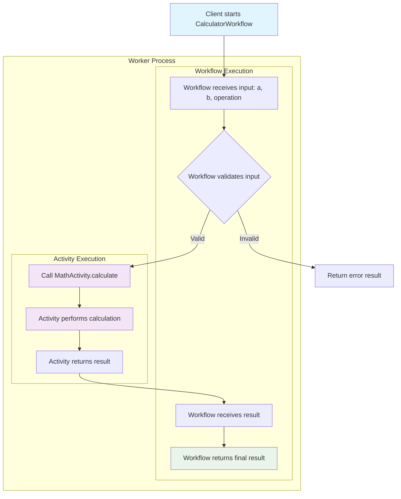

# 📜 Diagram for Lesson 5: Adding a Simple Activity

This diagram visualizes the core architecture and communication flow between a workflow and its activities in this lesson.

> 💡 This diagram shows the fundamental pattern of Temporal workflows: the workflow orchestrates business logic by calling activities, which perform the actual work and return results back to the workflow. 