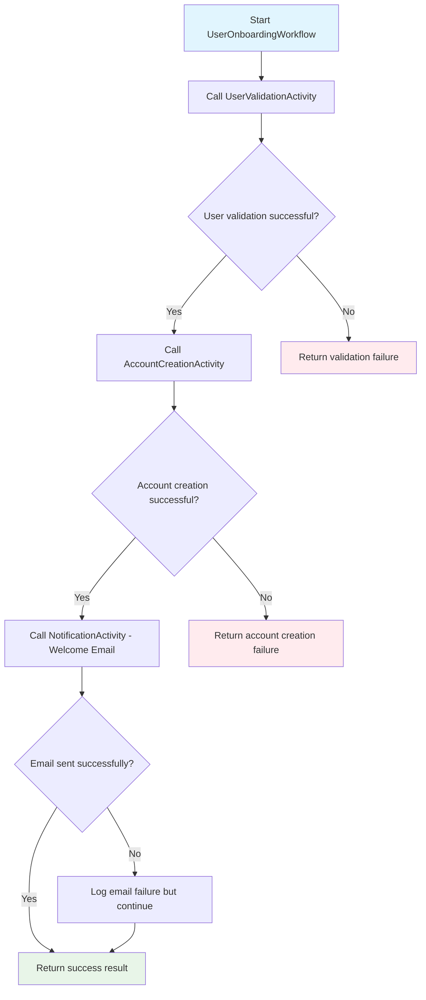
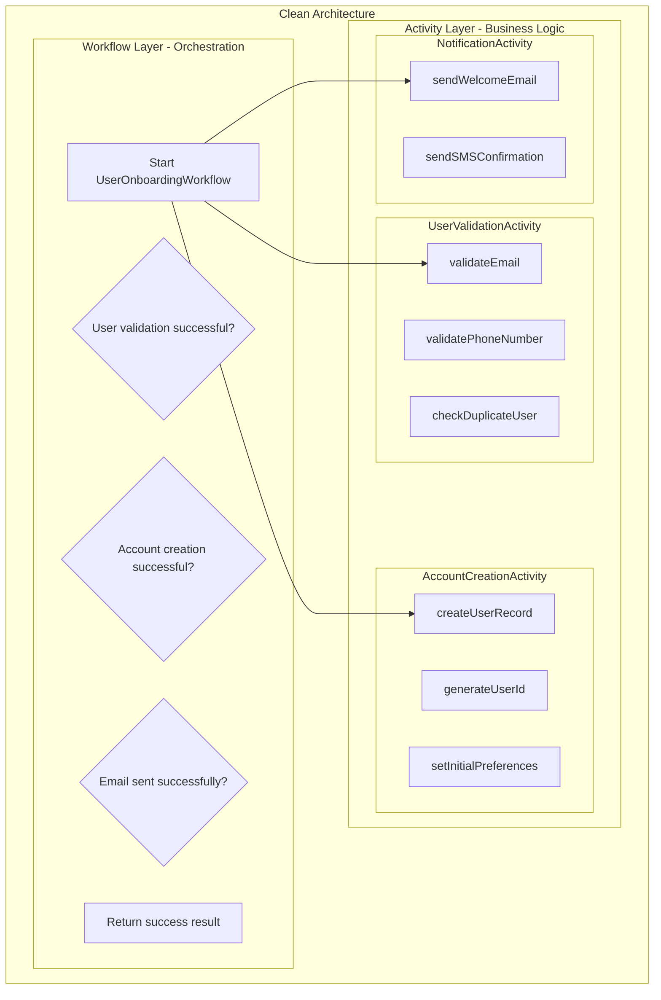

# 📜 Diagram for Lesson 6: Workflow & Activity Separation

## Visualizing Clean Architecture Patterns

*Clean architecture pattern with separated workflow orchestration and activity implementations in the user onboarding process*

---

# User Onboarding Workflow Architecture

---

# Clean Architecture Layers

---

# 💡 Key Architecture Insights

## **Clean Separation of Concerns:**

- ✅ **Workflows handle orchestration logic** - decision points and flow control
- ✅ **Activities contain actual business logic** - focused, testable implementations
- ✅ **Each activity has focused responsibility** - single purpose, easy to maintain
- ✅ **Activities can be tested independently** - unit testing friendly
- ✅ **Clear boundaries** between coordination and execution

---

# Error Handling Strategy

## **Critical vs Non-Critical Failures:**

- 🔴 **Critical**: Validation and Account Creation → **Stop Process**
- 🟡 **Non-Critical**: Email Notification → **Log and Continue**

## **Benefits:**
- **Graceful degradation** for non-essential features
- **Clear failure boundaries** with specific recovery actions
- **User experience** isn't blocked by secondary failures
- **System resilience** through intelligent error handling

---

# 🚀 Production Benefits

**This architecture pattern provides:**

- ✅ **Maintainability** - Clear separation makes changes easier
- ✅ **Testability** - Each component can be tested in isolation
- ✅ **Scalability** - Activities can scale independently
- ✅ **Reliability** - Failure isolation prevents cascading issues
- ✅ **Observability** - Clear flow visibility for debugging

**Perfect foundation for enterprise workflows! 🎉** 