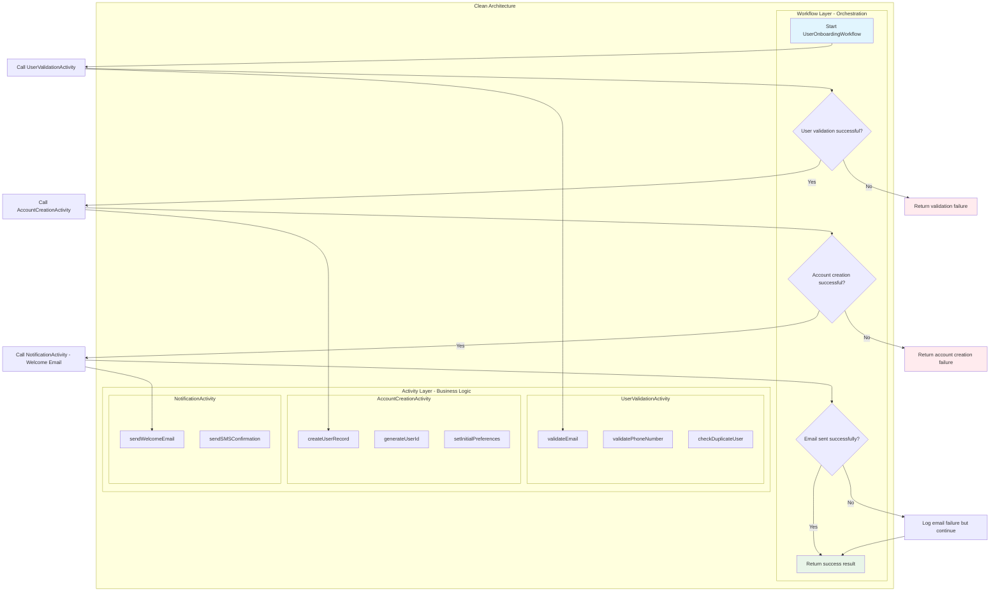

# 📜 Diagram for Lesson 6: Workflow & Activity Separation

This diagram visualizes the clean architecture pattern with separated workflow orchestration and activity implementations in the user onboarding process.

> 💡 This diagram demonstrates the clean separation of concerns: workflows handle orchestration logic while activities contain the actual business logic implementations. Each activity has a focused responsibility and can be tested independently. 