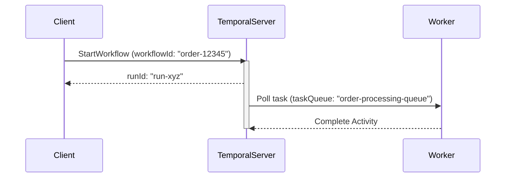

# 📘 Temporal Workflow Concepts

This document outlines the key identifiers in a Temporal workflow: `workflowType`, `workflowId`, `runId`, and `taskQueue`.

---

## 🔑 Key Fields Explained

| Field          | Description                                                                       |
| -------------- | --------------------------------------------------------------------------------- |
| `workflowType` | The **name of the workflow class or function** (defined in code).                 |
| `workflowId`   | The **unique identifier** for a workflow execution. Used to ensure idempotency.   |
| `runId`        | A unique ID for a **specific run** of the workflow. Changes on retries/restarts.  |
| `taskQueue`    | The name of the **queue** where the workflow or activity is polled and processed. |

---

## 🧹 Code Example

```kotlin
val options = WorkflowOptions.newBuilder()
    .setTaskQueue("order-processing-queue")
    .setWorkflowId("order-12345")
    .build()

val workflow = client.newWorkflowStub(OrderWorkflow::class.java, options)
WorkflowClient.start(workflow::placeOrder)
```

In this example:

* `workflowType`: `OrderWorkflow` (inferred from the stub)
* `workflowId`: `order-12345`
* `taskQueue`: `"order-processing-queue"`
* `runId`: Generated at runtime

---

## 🔁 `workflowId` vs `runId`

| Property | `workflowId`                 | `runId`                            |
| -------- | ---------------------------- | ---------------------------------- |
| Scope    | Logical workflow             | Specific execution/run             |
| Changes? | ❌ Never                      | ✅ Yes (new ID on retry or restart) |
| Use Case | Query, signal, deduplication | History inspection, debugging      |

---

## 🛍 Mermaid Diagram



---

## 🌟 Usage Summary

### `workflowType`

* Defined in code: class/interface (e.g., `OrderWorkflow`)
* Used for routing to the correct workflow implementation

### `workflowId`

* Application-controlled
* Enables deduplication, signals, queries

### `runId`

* Server-generated
* Used to debug specific workflow runs

### `taskQueue`

* Decouples workflow definition from execution
* Enables horizontal scaling of workers

---

## 🔍 CLI Usage

```bash
tctl workflow show --workflow-id order-12345
tctl workflow show --workflow-id order-12345 --run-id abcdef123456
```

---

## ✅ Best Practices

* Use UUIDs or meaningful domain IDs for `workflowId`
* Keep `taskQueue` names environment-specific (e.g., `"email-prod"` vs `"email-dev"`)
* Avoid randomness inside workflows (ensure determinism)

---
