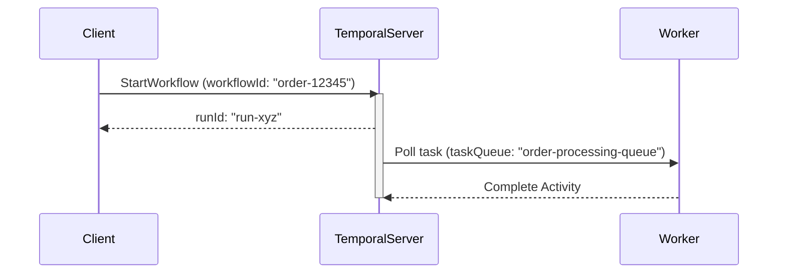

# 📘 Temporal Workflow Concepts

## Understanding Core Identifiers

*Key identifiers in a Temporal workflow: `workflowType`, `workflowId`, `runId`, and `taskQueue`*

---

# 🔑 Key Fields Explained

| Field | Description |
|-------|-------------|
| **`workflowType`** | The **name of the workflow class or function** (defined in code) |
| **`workflowId`** | The **unique identifier** for a workflow execution. Used to ensure idempotency |
| **`runId`** | A unique ID for a **specific run** of the workflow. Changes on retries/restarts |
| **`taskQueue`** | The name of the **queue** where the workflow or activity is polled and processed |

---

# 🧹 Code Example

```kotlin
val options = WorkflowOptions.newBuilder()
    .setTaskQueue("order-processing-queue")
    .setWorkflowId("order-12345")
    .build()

val workflow = client.newWorkflowStub(OrderWorkflow::class.java, options)
WorkflowClient.start(workflow::placeOrder)
```

## **In this example:**

- **`workflowType`**: `OrderWorkflow` (inferred from the stub)
- **`workflowId`**: `order-12345`
- **`taskQueue`**: `"order-processing-queue"`
- **`runId`**: Generated at runtime

---

# 🔁 `workflowId` vs `runId`

| Property | **`workflowId`** | **`runId`** |
|----------|------------------|-------------|
| **Scope** | Logical workflow | Specific execution/run |
| **Changes?** | ❌ Never | ✅ Yes (new ID on retry or restart) |
| **Use Case** | Query, signal, deduplication | History inspection, debugging |

## **Key Distinction:**
- **`workflowId`** → **Business identity** (same across retries)
- **`runId`** → **Execution identity** (unique per attempt)

---

# 🛍 Workflow Lifecycle Diagram



**Shows how identifiers flow through the Temporal system**

---

# 🌟 Usage Summary

## **`workflowType`**
- **Defined in code**: class/interface (e.g., `OrderWorkflow`)
- **Used for routing** to the correct workflow implementation

## **`workflowId`**
- **Application-controlled** identifier
- **Enables deduplication**, signals, queries

## **`runId`**
- **Server-generated** identifier
- **Used to debug** specific workflow runs

## **`taskQueue`**
- **Decouples** workflow definition from execution
- **Enables horizontal scaling** of workers

---

# 🔍 CLI Usage

```bash
# Show workflow by workflow ID
tctl workflow show --workflow-id order-12345

# Show specific run of workflow
tctl workflow show --workflow-id order-12345 --run-id abcdef123456
```

## **Production Operations:**
- **Query workflows** by business ID (`workflowId`)
- **Debug specific executions** using `runId`
- **Monitor task queues** for scaling decisions

---

# ✅ Best Practices

## **Workflow ID Guidelines:**
- ✅ **Use UUIDs** or meaningful domain IDs for `workflowId`
- ✅ **Include business context** (e.g., `order-12345`, `user-onboarding-abc`)
- ✅ **Avoid random values** for better traceability

## **Task Queue Guidelines:**
- ✅ **Keep names environment-specific** (e.g., `"email-prod"` vs `"email-dev"`)
- ✅ **Use descriptive names** (`"order-processing"` not `"queue1"`)
- ✅ **Separate by function** (different queues for different workflow types)

## **General Guidelines:**
- ✅ **Avoid randomness inside workflows** (ensure determinism)
- ✅ **Use meaningful identifiers** for easier debugging

---

# 💡 Key Takeaways

## **What You've Learned:**

- ✅ **Workflow identifiers** serve different purposes in the system
- ✅ **`workflowId`** provides business identity and deduplication
- ✅ **`runId`** enables debugging specific executions
- ✅ **`taskQueue`** enables scaling and deployment flexibility
- ✅ **Best practices** ensure maintainable and debuggable workflows

---

# 🚀 Production Impact

**Understanding these identifiers enables:**

- ✅ **Effective monitoring** and alerting
- ✅ **Efficient debugging** of production issues
- ✅ **Proper scaling** strategies
- ✅ **Clean deployment** patterns
- ✅ **Business traceability** across systems

**Essential knowledge for production Temporal systems! 🎉**
