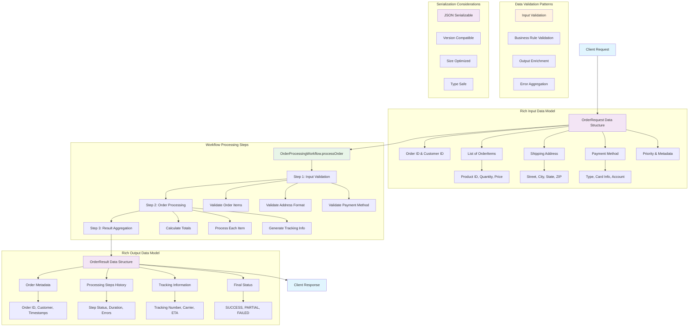

# 📜 Diagram for Lesson 7: Workflow Input/Output

This diagram visualizes complex data flow patterns for workflow input/output handling with rich data structures and validation.

> 💡 This diagram demonstrates how to design rich data structures for workflow input and output, including comprehensive validation, processing steps tracking, and structured result reporting that maintains type safety and serialization compatibility. 