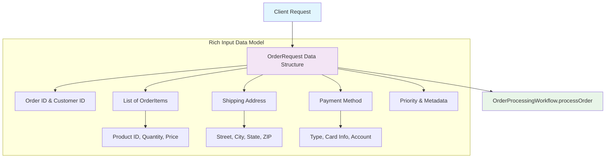
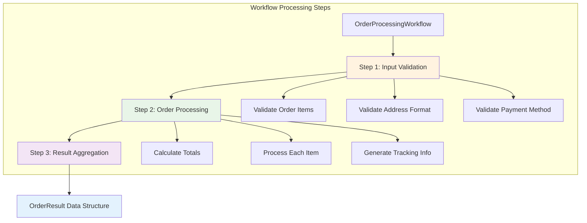
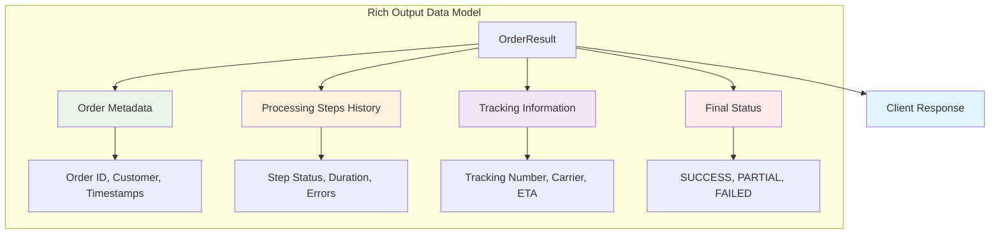
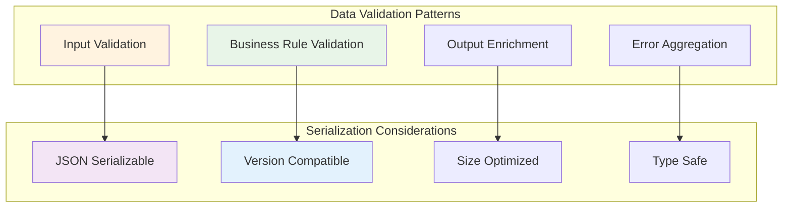

# 📜 Diagram for Lesson 7: Workflow Input/Output

## Visualizing Complex Data Flow Patterns

*Complex data flow patterns for workflow input/output handling with rich data structures and validation*

---

# Order Processing Data Flow

---

# Workflow Processing Pipeline

---

# Rich Output Data Model

---

# Data Design Patterns

---

# 💡 Key Data Flow Insights

## **Input Design Patterns:**

- ✅ **Rich data structures** with clear relationships
- ✅ **Nested objects** for complex business domains
- ✅ **Type safety** through data classes and enums
- ✅ **Validation boundaries** at workflow entry points

## **Processing Patterns:**

- ✅ **Step-by-step validation** with clear error reporting
- ✅ **Business logic separation** between validation and processing
- ✅ **Tracking and audit** of all processing steps

---

# Output Design Best Practices

## **Comprehensive Results:**

- ✅ **Status information** for success/failure determination
- ✅ **Processing history** for audit and debugging
- ✅ **Rich metadata** for downstream system integration
- ✅ **Error context** for meaningful failure responses

## **Serialization Requirements:**

- ✅ **JSON compatible** for API integration
- ✅ **Version safe** for schema evolution
- ✅ **Size optimized** for performance
- ✅ **Type safe** for compile-time validation

---

# 🚀 Production Benefits

**This data flow pattern provides:**

- ✅ **Type safety** throughout the entire workflow lifecycle
- ✅ **Rich observability** through comprehensive result tracking
- ✅ **Easy debugging** with detailed processing history
- ✅ **API compatibility** through structured input/output
- ✅ **Schema evolution** support for changing requirements

**Building robust, maintainable data flows! 🎉** 