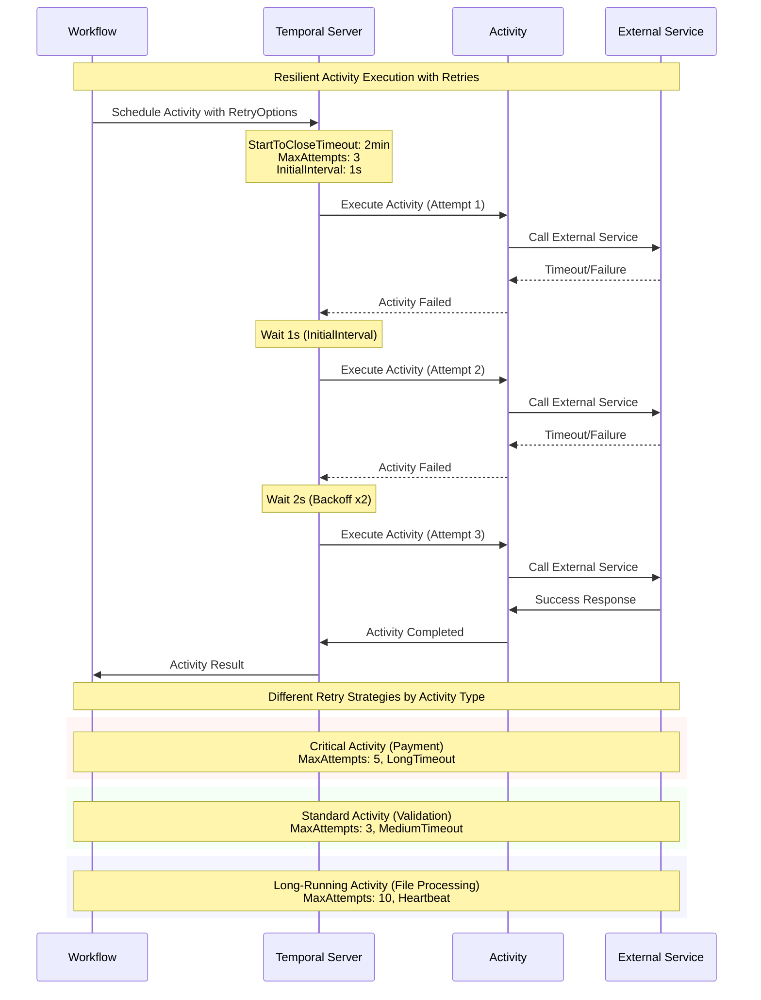

# 📜 Diagram for Lesson 8: Activity Retry + Timeout

This diagram visualizes the retry patterns and timeout strategies for resilient activity execution.

> 💡 This sequence diagram shows how Temporal automatically retries failed activities with exponential backoff, and demonstrates different retry strategies for different types of activities based on their criticality and expected duration. 