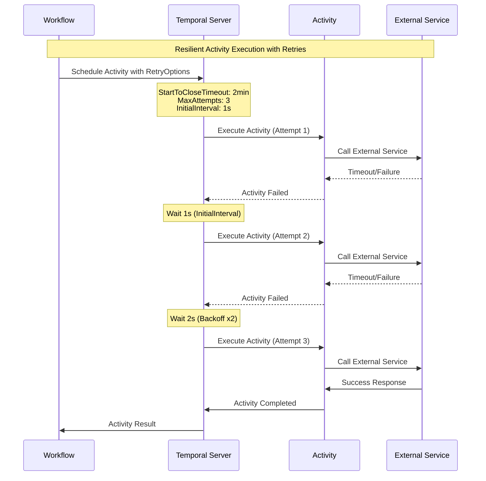
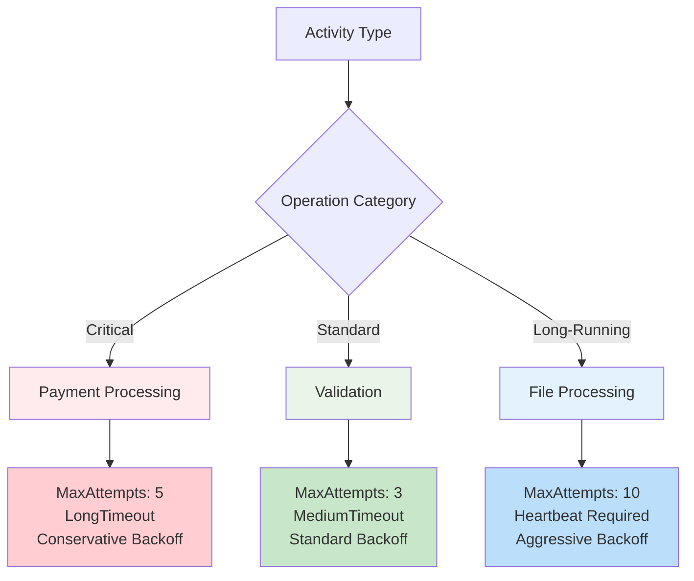

# 📜 Diagram for Lesson 8: Activity Retry + Timeout

## Visualizing Resilient Activity Execution

*Retry patterns and timeout strategies for resilient activity execution*

---

# Activity Retry Flow with Exponential Backoff

---

# Retry Strategy by Activity Type

---

# 💡 Key Insights from the Diagram

## **Retry Flow Characteristics:**

- ✅ **Automatic retry handling** by Temporal Server
- ✅ **Exponential backoff** prevents service overload
- ✅ **Configurable max attempts** prevents infinite retries
- ✅ **Success on final attempt** shows resilience in action

## **Strategy Differentiation:**

- 🔴 **Critical activities** (payments) → **Conservative, fewer attempts**
- 🟢 **Standard activities** (validation) → **Balanced approach**
- 🔵 **Long-running activities** (file processing) → **More attempts, heartbeats**

---

# Timeout and Heartbeat Strategy

## **Timeout Hierarchy:**
- **ScheduleToStartTimeout** → Maximum queue wait time
- **StartToCloseTimeout** → Single execution time limit
- **ScheduleToCloseTimeout** → Total time including all retries
- **HeartbeatTimeout** → Progress reporting frequency

## **Benefits:**
- **Prevents stuck workflows** through proper timeout configuration
- **Enables progress monitoring** through heartbeat reporting
- **Balances resilience** with resource efficiency

---

# 🚀 Production Resilience

**This diagram demonstrates production-ready patterns for:**

- ✅ **Service failure recovery** through smart retry policies
- ✅ **Resource protection** via timeout boundaries
- ✅ **System stability** through exponential backoff
- ✅ **Operational visibility** via heartbeat monitoring

**Building fault-tolerant distributed systems! 🎉** 