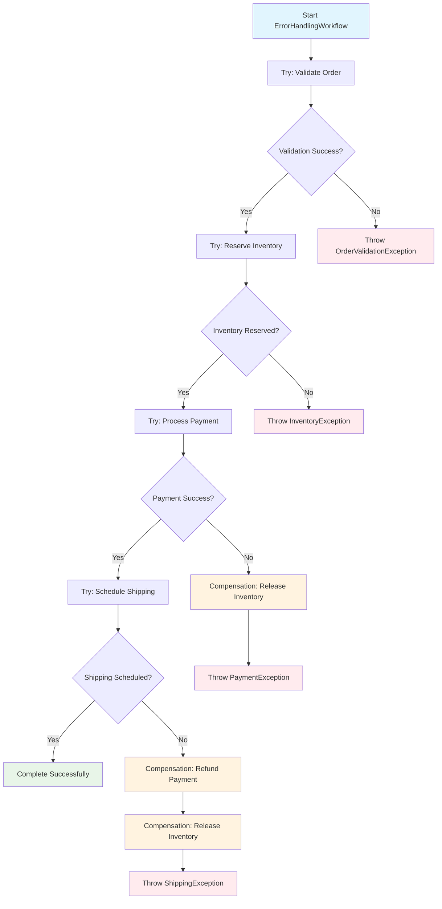
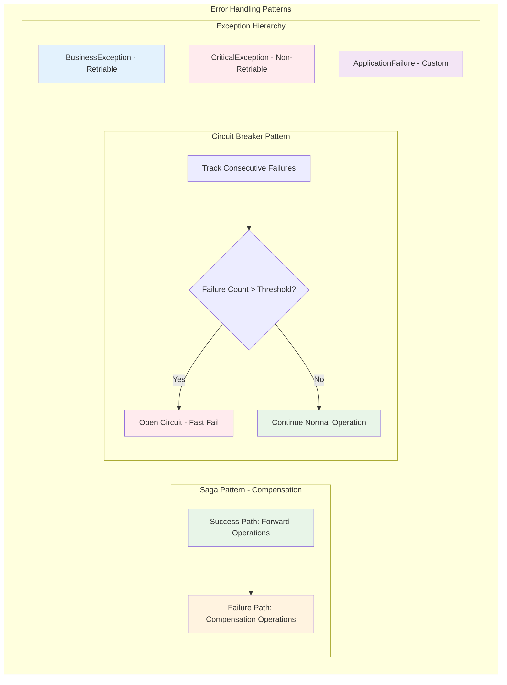

# 📜 Diagram for Lesson 9: Error Handling in Workflows

## Visualizing Error Handling & Compensation Patterns

*Error handling patterns including the Saga pattern with compensation logic and circuit breaker implementation*

---

# Error Handling Flow with Compensation

---

# Error Handling Pattern Categories

---

# 💡 Key Insights from Error Handling

## **Saga Pattern (Compensation):**

- ✅ **Forward operations** create business value
- ✅ **Compensation operations** undo changes on failure
- ✅ **Order matters** - compensate in reverse order
- ✅ **Idempotent compensations** are safe to retry

## **Circuit Breaker Pattern:**

- ✅ **Tracks failure rate** of external services
- ✅ **Opens circuit** when threshold exceeded
- ✅ **Fast fails** prevent resource waste
- ✅ **Automatic recovery** when service stabilizes

---

# Exception Classification Strategy

## **Error Handling Decision Matrix:**

| Error Type | Action | Compensation | Recovery |
|------------|--------|--------------|----------|
| **Validation** | Fail Fast | None | Fix input |
| **Business Rule** | Fail Fast | None | Change business logic |
| **Resource** | Retry | Release | Wait and retry |
| **External Service** | Circuit Breaker | Rollback | Service recovery |

**Smart error classification enables appropriate response strategies**

---

# 🚀 Production Benefits

**This error handling approach provides:**

- ✅ **Data consistency** through compensation patterns
- ✅ **System stability** via circuit breakers
- ✅ **Fast failure detection** with custom exceptions
- ✅ **Resource protection** through smart retry logic
- ✅ **Operational visibility** with structured error context

**Building bulletproof distributed systems! 🎉** 