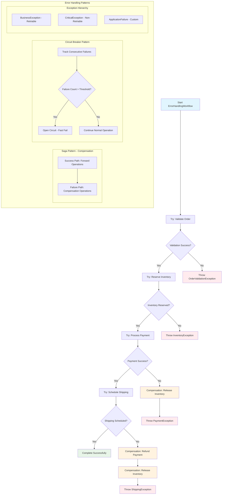

# 📜 Diagram for Lesson 9: Error Handling in Workflows

This diagram visualizes the error handling patterns including the Saga pattern with compensation logic and circuit breaker implementation.

> 💡 This flowchart demonstrates the Saga pattern where each forward operation has a corresponding compensation operation, ensuring data consistency even when failures occur partway through a complex business process. The circuit breaker pattern prevents cascading failures by fast-failing when error thresholds are exceeded. 