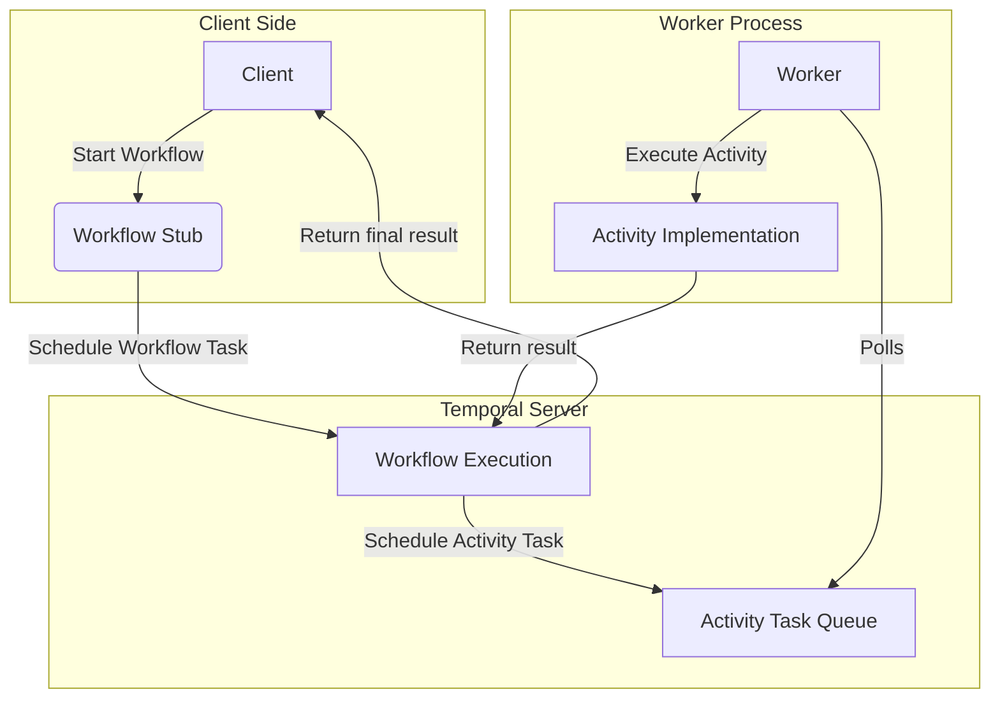

# 🧠 Temporal Basic Architecture

## Understanding Core Concepts with Visual Diagrams

This presentation helps students clearly understand the **core concepts of Temporal**: Workflow, Activity, Worker, and how they relate.

We'll simplify the internal architecture and illustrate the flow of execution.

---

# 📘 Core Definitions

## **Workflow**
The main orchestrator. Defines *what* should happen and *in what order*. 
- ✅ Durable
- ✅ Stateful 
- ✅ Resumable

## **Activity**  
A unit of work that does the actual job (e.g., sending emails, processing payments).
- ✅ Stateless
- ✅ Retryable
- ✅ Can timeout

---

# Core Definitions Continued

## **Worker**
A process/service that hosts Workflow and Activity implementations and polls the Temporal server for tasks.

## **Temporal Server**
Manages state, schedules tasks, handles retries and failures. 
**Think of it as the brain behind the system.**

---

# 📈 Architecture Diagram

---

# 📝 How to Read the Diagram

## **Step-by-step flow:**

1. **Client** initiates a Workflow using a stub (proxy)
2. The **Workflow code** is executed by the **Worker**, but orchestrated by the **Temporal Server**
3. The **Workflow schedules Activities**, which are picked up and executed by **Workers**
4. **Workers send back results** to the Workflow
5. The **Workflow resumes or finishes**

---

# 💡 Key Concepts Comparison

| Concept  | Durable | Stateless | Retry/Timeout Logic | Hosted By |
|----------|---------|-----------|-------------------|-----------|
| Workflow | ✅      | ❌        | Handled by Temporal | Worker    |
| Activity | ❌      | ✅        | Handled by Temporal | Worker    |
| Worker   | N/A     | N/A       | N/A              | You       |

**Key Insight**: Temporal handles all the complex retry and state management for you!

---

# ✅ Best Way to Remember

## **Mental Model Analogy:**

- 🧠 **Workflow** = Brain (plans what to do)
- 🤲 **Activity** = Hands (do the actual work)  
- 🤖 **Worker** = Robot (runs the brain and moves the hands)
- 🏢 **Temporal Server** = Mission Control (coordinates everything)

---

# 🎯 Why This Architecture Matters

## **Separation of Concerns:**
- **Orchestration logic** (Workflow) vs **Business logic** (Activity)
- **Stateful coordination** vs **Stateless execution**

## **Reliability:**
- Workflows survive crashes and resume where they left off
- Activities can be retried automatically
- Everything is durable and observable

---

# 🚀 Ready for the Journey?

**This basic understanding and mental model will make every following lesson click more easily.**

## **Key Takeaway:**
**Think in flows, not functions!**

Your mind is now prepared to tackle Temporal workflows with confidence.

---

