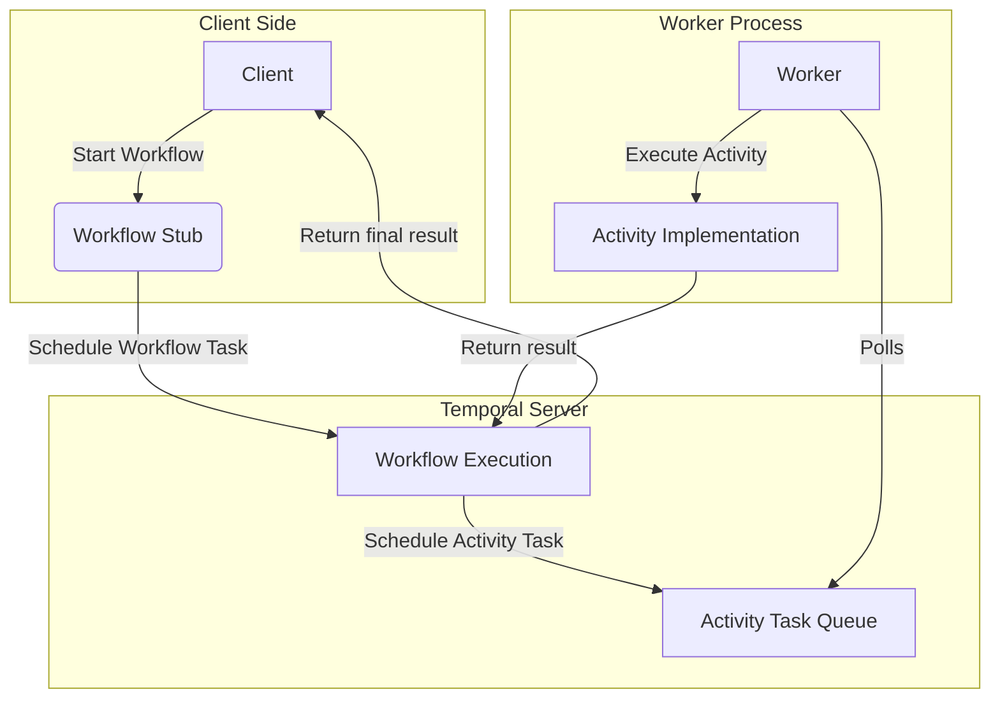

## 🧠 Temporal Basic Architecture Diagram (with Mermaid)

This diagram is designed to help students clearly understand the **core concepts of Temporal**: Workflow, Activity, Worker, and how they relate. It simplifies the internal architecture and illustrates the flow of execution.

---

### 📘 Definitions

* **Workflow**: The main orchestrator. It defines *what* should happen and *in what order*. Workflows are durable, stateful, and resumable.

* **Activity**: A unit of work that does the actual job (e.g., sending emails, processing payments). Activities are stateless and can be retried or timed out.

* **Worker**: A process/service that hosts Workflow and Activity implementations and polls the Temporal server for tasks.

* **Temporal Server**: Manages state, schedules tasks, handles retries and failures. Think of it as the brain behind the system.

---

### 📈Architecture Diagram

---

### 📝 How to Read This

* **Client** initiates a Workflow using a stub (proxy).
* The **Workflow code** is executed by the **Worker**, but orchestrated by the **Temporal Server**.
* The **Workflow schedules Activities**, which are picked up and executed by **Workers**.
* **Workers send back results** to the Workflow, and the **Workflow resumes or finishes**.

---

### 💡 Key Concepts Recap

| Concept  | Durable | Stateless | Retry/Timeout Logic | Hosted By |
| -------- | ------- | --------- | ------------------- | --------- |
| Workflow | ✅       | ❌         | Handled by Temporal | Worker    |
| Activity | ❌       | ✅         | Handled by Temporal | Worker    |
| Worker   | N/A     | N/A       | N/A                 | You       |

---

### ✅ Best Way to Remember

* **Workflow** = Brain (plans what to do)
* **Activity** = Hands (do the actual work)
* **Worker** = Robot (runs the brain and moves the hands)
* **Temporal Server** = Mission Control (coordinates everything)

---

This basic understanding and mental model will make every following lesson click more easily. Think in flows, not functions!
