# 📊 Temporal Loan Application System - Architecture Diagrams

## 🏗️ System Architecture Overview


## 🔄 Loan Application Workflow Sequence

```mermaid
sequenceDiagram
    participant Client
    participant Controller
    participant LoanWorkflow
    participant DocumentActivity
    participant RiskActivity
    participant DisbursementActivity
    participant NotificationActivity
    participant CreditBureau
    participant BankAPI
    
    Note over Client,BankAPI: Loan Application Process
    
    Client->>Controller: POST /api/loan/apply
    Controller->>LoanWorkflow: Start Workflow
    LoanWorkflow->>LoanWorkflow: 📝 Persist: Application Received
    
    Note over LoanWorkflow,CreditBureau: Step 1: Document Validation
    LoanWorkflow->>DocumentActivity: Validate Documents
    DocumentActivity->>DocumentActivity: Check required docs
    DocumentActivity->>LoanWorkflow: ✅ Documents Valid
    LoanWorkflow->>LoanWorkflow: 📝 Persist: Documents Validated
    
    Note over LoanWorkflow,CreditBureau: Step 2: Risk Scoring (with Retries)
    LoanWorkflow->>RiskActivity: Calculate Risk Score
    RiskActivity->>CreditBureau: Get Credit Score
    CreditBureau-->>RiskActivity: ❌ Service Timeout
    Note over RiskActivity: Auto-retry with backoff (2s)
    RiskActivity->>CreditBureau: Get Credit Score (Retry 1)
    CreditBureau-->>RiskActivity: ❌ Rate Limited
    Note over RiskActivity: Auto-retry with backoff (4s)
    RiskActivity->>CreditBureau: Get Credit Score (Retry 2)
    CreditBureau->>RiskActivity: ✅ Credit Score: 750
    RiskActivity->>LoanWorkflow: ✅ Risk Score: LOW
    LoanWorkflow->>LoanWorkflow: 📝 Persist: Risk Assessment Complete
    
    Note over LoanWorkflow,BankAPI: Step 3: Wait for Approval Signal
    LoanWorkflow->>LoanWorkflow: ⏳ Await Approval Signal
    Controller->>LoanWorkflow: 🔔 Approval Signal
    LoanWorkflow->>LoanWorkflow: 📝 Persist: Application Approved
    
    Note over LoanWorkflow,BankAPI: Step 4: Loan Disbursement
    LoanWorkflow->>DisbursementActivity: Disburse Loan
    DisbursementActivity->>BankAPI: Transfer Funds
    BankAPI->>DisbursementActivity: ✅ Transfer Complete
    DisbursementActivity->>LoanWorkflow: ✅ Loan Disbursed
    LoanWorkflow->>LoanWorkflow: 📝 Persist: Loan Disbursed
    
    Note over LoanWorkflow,BankAPI: Step 5: Notifications & Follow-up
    LoanWorkflow->>NotificationActivity: Send Confirmation
    NotificationActivity->>NotificationActivity: Send Email & SMS
    NotificationActivity->>LoanWorkflow: ✅ Notifications Sent
    LoanWorkflow->>LoanWorkflow: Start Follow-up Workflow
    LoanWorkflow->>Controller: ✅ Application Complete
    Controller->>Client: ✅ Success Response
    
    rect rgb(255, 245, 245)
        Note over Client,BankAPI: 🛡️ Temporal Guarantees:<br/>• State persisted at each step<br/>• Automatic retries with exponential backoff<br/>• Workflow survives crashes and restarts<br/>• Exactly-once execution semantics<br/>• Complete audit trail and observability
    end
```



## 🔀 Signal and Query Interactions


## 🏗️ Class Diagram - Domain Model

```mermaid
classDiagram
    class LoanApplication {
        +String workflowId
        +String userId
        +String firstName
        +String lastName
        +String email
        +String phone
        +BigDecimal loanAmount
        +LoanPurpose purpose
        +BigDecimal annualIncome
        +List~DocumentType~ documents
        +ApplicationStatus status
        +LocalDateTime createdAt
        +LocalDateTime updatedAt
    }
    
    class RiskAssessment {
        +String applicationId
        +Integer creditScore
        +RiskLevel riskLevel
        +BigDecimal debtToIncomeRatio
        +List~String~ riskFactors
        +LocalDateTime assessedAt
    }
    
    class ApprovalDecision {
        +String applicationId
        +String approvedBy
        +ApprovalStatus status
        +String notes
        +LocalDateTime decidedAt
    }
    
    class LoanDisbursement {
        +String applicationId
        +String transactionId
        +BigDecimal amount
        +String bankAccount
        +DisbursementStatus status
        +LocalDateTime disbursedAt
    }
    
    class FollowUpTask {
        +String applicationId
        +FollowUpType type
        +LocalDateTime scheduledAt
        +Boolean completed
        +String notes
    }
    
    LoanApplication ||--|| RiskAssessment
    LoanApplication ||--|| ApprovalDecision
    LoanApplication ||--|| LoanDisbursement
    LoanApplication ||--o{ FollowUpTask
    
    class LoanApplicationWorkflow {
        +processApplication(LoanApplication)
        +handleApprovalSignal(ApprovalDecision)
        +handleRejectionSignal(RejectionDecision)
        +getCurrentState()
        +getApplicationDetails()
    }
    
    class DocumentValidationActivity {
        +validateDocuments(LoanApplication)
    }
    
    class RiskScoringActivity {
        +calculateRiskScore(LoanApplication)
    }
    
    class LoanDisbursementActivity {
        +disburseLoan(LoanApplication)
        +compensateFailedDisbursement(String)
    }
    
    class NotificationActivity {
        +sendApplicationConfirmation(LoanApplication)
        +sendApprovalNotification(LoanApplication)
        +sendRejectionNotification(LoanApplication)
    }
    
    LoanApplicationWorkflow --> DocumentValidationActivity
    LoanApplicationWorkflow --> RiskScoringActivity
    LoanApplicationWorkflow --> LoanDisbursementActivity
    LoanApplicationWorkflow --> NotificationActivity
```

## 🔄 Child Workflow - Follow-up Process


## 📊 Deployment Architecture


---

> 💡 **Key Insight**: These diagrams show how Temporal orchestrates complex business processes across multiple services while maintaining reliability, observability, and scalability. The loan application system demonstrates enterprise-grade workflow patterns that can be applied to any domain. 